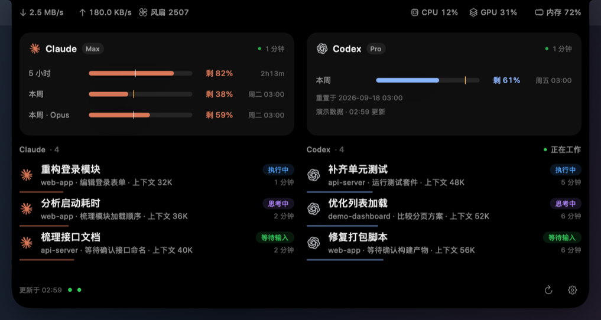

# AgentIsland

简体中文：[README.md](README.md)

Turn your Mac's notch into a compact Claude Code and Codex quota and session panel.

See remaining quota at a glance. Working sessions get rotating icons and activity bars; hover or click to expand quota cards, session details and system metrics. Completed sessions never open the panel automatically.

All screenshots use built-in mock data, including plans, usage, sessions and system metrics.
Dates use a fixed example timestamp displayed in UTC. EXIF/XMP and other ancillary metadata have been removed.

**Collapsed** — Claude on the left, Codex on the right.


**Active** — a still frame of working-session indicators.


**Expanded** — system metrics, two quota cards, and sessions grouped by agent in two columns: Claude on the left, Codex on the right.



Sessions are sorted by status: running tools first, then thinking (including compacting and retrying), followed by waiting for permission, waiting for input, error, idle, and ended. Within each priority tier, sessions from the same project stay together, with project groups ordered by their latest activity and unnamed projects last. Sessions within each group use newest activity first. Each agent is sorted independently in two-column mode; single-column mode sorts the merged list.

Settings → Session list → Layout (设置 → 会话列表 → 布局) defaults to Auto (自动): agent columns appear with at least 5 non-ended sessions and at least 880 pt of available centered panel width. Choose Single column (单列) for a merged list or Two columns (双列) to keep Claude on the left and Codex on the right regardless of count; insufficient screen space always falls back to one column, even with Two columns selected. Headers show each agent’s active count. Empty columns keep a placeholder, and shorter columns leave blank space. Expanding details changes only that column; both columns scroll together.

## Requirements

- macOS 14 or later, Apple Silicon or Intel.
- Best on a MacBook with a notch; other displays use a capsule at the top.
- Install and sign in to Claude Code / Codex to see the corresponding data.
- Swift 6 and Command Line Tools to build. No Xcode or third-party dependencies required.

## Privacy

**No data collection, telemetry or session-content uploads.** Local session files are read to display information on your Mac:

- Claude session metadata, main-session transcripts and desktop session titles.
- Codex's SQLite session index (read-only) and rollout logs as a fallback.
- Claude OAuth credentials, read at runtime through the system keychain, with `~/.claude/.credentials.json` as a compatibility fallback. Tokens stay in memory and are never logged or exported. AgentIsland does not read Claude session key files or `~/.codex/auth.json`.

AgentIsland's own HTTP client only contacts the Claude usage endpoint at `api.anthropic.com`; it does not follow redirects or retain HTTP caches or cookies. Codex quota comes from the official `codex app-server` subprocess. Official subprocesses may contact their own services, including during Claude token renewal described below.

AgentIsland itself reads provider data and settings without modifying them, installing hooks or changing statusLine. Its settings and connection diagnostics remain in its own local storage. Official CLI renewal may update official credentials. Diagnostic exports such as `--dump sessions` contain titles and project paths; redact them before sharing.

Brand icons are loaded from locally installed Claude / ChatGPT apps, with drawn fallbacks. Third-party icon files are not bundled or distributed as standalone assets; screenshots illustrate the interface.

## Custom data sources

Open Settings → Custom data sources (自定义数据源) → Add (添加), enter a name and command, choose a 1 / 5 / 15 / 30 minute interval (default: 5), and use Test run (测试运行) before saving. This feature requires scripting knowledge; no additional services are built in. Optionally choose a local `.app` icon and badge color. Enable, edit, delete, or reorder providers with ↑ / ↓. The collapsed wings show the first two enabled quota providers; expanded quota cards use two columns.

Commands run as the current user via `/bin/zsh -lc`, with the user home directory as the working directory. The login shell loads PATH from `.zprofile`; use absolute paths if a command cannot be found. Each source refreshes independently, including on launch, unlock, wake, and manual refresh. Lock and sleep pause execution. The same source never runs concurrently; at most three custom commands run at once, including test previews. Commands time out after 15 seconds: SIGTERM targets the entire process group, followed by SIGKILL after two seconds if needed. Disabling or deleting a source also terminates its group. Failures retain the last successful data and mark it stale.

Standard output may contain a single remaining-percentage number or full JSON:

```json
{
  "windows": [
    { "label": "This week", "remainingPercent": 62, "resetsAt": "2026-01-08T00:00:00Z", "periodSeconds": 604800 },
    { "label": "Balance", "valueText": "¥128.50" }
  ],
  "plan": "Pro",
  "note": "Optional one-line description"
}
```

`windows` accepts 1–4 entries; additional entries are ignored with a warning. Each window has a `label` and exactly one of `remainingPercent`, `usedPercent`, or `valueText`. Percentages must be finite and are clamped to 0–100; text is limited to 12 characters. Settings display warnings for missing labels, truncated text, and extra windows. Unknown fields are ignored. `plan`, `note`, ISO 8601 `resetsAt`, and positive `periodSeconds` are optional. The first window is a custom source's headline. When only one source is enabled, complete periods select the shortest and longest windows; otherwise the first two windows are used. Wing text truncates to the available width.

Example 1 — a remaining percentage:

```sh
echo 62
```

Example 2 — static JSON (40% used, 60% remaining by default):

```sh
echo '{"windows":[{"label":"本月","usedPercent":40}]}'
```

Example 3 — **placeholder template, not a working integration with any real service**. The URL, keychain item name, and response fields are hypothetical: adapt them to your service's official documentation and create the corresponding keychain entry yourself. Keep this in your own script and enter only its path in settings. `jq` ships with macOS 15 and later; install it yourself on earlier versions.

```sh
#!/bin/zsh
set -euo pipefail
quota_api_key=$(/usr/bin/security find-generic-password -s 'ExampleQuotaKey' -w)
curl --fail --silent --show-error \
  --header "Authorization: Bearer ${quota_api_key}" \
  'https://quota.example.invalid/v1/usage' |
  jq '{windows: [{label: "This month", remainingPercent: .remaining_percent}]}'
```

Commands are stored in plain text in AgentIsland's own local UserDefaults. Do not inline API keys; read them from the keychain inside your script. The app never writes commands, raw stdout / stderr, or parsed results to logs, diagnostics, or caches; the command in settings is the sole persisted command copy. Stdout is limited to 64 KB; only the first 512 stderr bytes are kept in memory for error display. Network access and file writes performed by a user script depend on that script.

Custom entries in `--dump providers` contain only ID, name, enabled state, last run time, and status category. Run history is in memory, so a new dump process reports empty run history. `--dump quota` executes enabled custom sources once and exports parsed quota data only (error categories only on failure). Mock and snapshot modes use fixtures without executing user commands. Isolated `--home` diagnostics do not load local custom settings.

## Download and install

No Swift toolchain is needed. Download `AgentIsland-<version>-macOS-universal.zip` from this repository's [Releases page](https://github.com/qp952154781/MacBookAgentIsland/releases). Requires macOS 14 or later.

The universal binary contains both Apple Silicon (arm64) and Intel (x86_64) slices. The Intel build has been cross-compiled and tested under Rosetta, but **has not been tested on a physical Intel Mac**; sensor readings such as fan speed may differ. Feedback from Intel users is welcome.

Optionally download the matching `.zip.sha256` file from the same release. Put both files in the same directory, open that directory in Terminal, and verify integrity (replace `<version>` with the downloaded version):

```sh
shasum -a 256 -c 'AgentIsland-<version>-macOS-universal.zip.sha256'
```

Unzip, then **drag `AgentIsland.app` into Applications before opening it**. Running directly from Downloads triggers macOS App Translocation, which runs the app from a random read-only location and breaks login-item registration.

**macOS will block the first launch.** This project has no paid Apple Developer certificate; the app is only ad-hoc signed and is not notarized by Apple. All source code is public, and you can also build it yourself as described below. Use either method to allow it:

- GUI: try opening the app once → **System Settings → Privacy & Security** → find the blocked AgentIsland near the bottom → **Open Anyway** → authenticate and confirm opening again.
- Terminal: after moving the app to Applications, run this command, then open the app:

```sh
xattr -dr com.apple.quarantine /Applications/AgentIsland.app
```

The island appears at the top of the screen, around the notch or as a top capsule on displays without one. **There is no Dock icon or regular window.** Hover over the island to expand it; right-click the island → Settings (设置).

**Upgrading:** right-click the island → Quit (退出), replace the old app in Applications with the new one, then open it. If macOS blocks it, follow the steps above. If launch at login stops working, turn it off and on again in Settings, since each build has a different ad-hoc signature.

## Build and install from source

```sh
scripts/build.sh release
scripts/test.sh
scripts/bundle.sh
```

Copy `dist/AgentIsland.app` to `/Applications` and open it. Quit an existing instance through the island's context menu first. Alternatively, `scripts/install.sh` builds and installs the app, keeping the previous bundle as `/Applications/AgentIsland.previous.app`; it does not launch the overlay.

The public bundle identifier is `org.agentisland.AgentIsland`. When upgrading from an early development build, disable its login item before replacing it, then configure the new app and enable its login item if needed. Old preferences are not migrated automatically.

Release builds remap source paths and omit debug maps from the executable to avoid embedding the builder's absolute paths. Use the default debug build for local debugging.

To start at login, right-click the island and open Settings after installing in Applications. Approve the login item in System Settings if requested. See the Chinese README for command-line options and troubleshooting.

## Limitations

- Downloaded builds are ad-hoc signed and not notarized; macOS will block the first launch. See **Download and install** above for the steps to allow it.
- Quota polling and system-metric sampling pause while locked or asleep. While the process can still run, session scans are limited to once per provider every 30 seconds; unlock or wake triggers an immediate refresh.
- **Claude token renewal starts the official CLI in a hidden pseudoterminal.** Access tokens typically expire after about eight hours, and ordinary non-interactive queries cannot trigger renewal. When renewal is needed, AgentIsland starts one interactive CLI session, waits for a ready prompt, sends the local `/usage` command to trigger official renewal, then exits. It sends no conversation prompt and uses no model quota. AgentIsland does not call the refresh endpoint or write keychain credentials itself; the official CLI may use the network and update its own credentials.
- Renewal uses a dedicated AgentIsland directory with Chrome prompts and Remote Control disabled by launch arguments. Setup, trust and login prompts stop the attempt and require you to finish in Terminal; the app never accepts them for you. CLI changes or expired login sessions can still require manual action.
- Provider formats may change. Fan metrics are hidden on unsupported devices. Both processor architectures are build targets, but not every hardware combination has been tested.

## Acknowledgments and license

Inspired by notch apps such as Notchy and NookX. This independent project is not affiliated with Anthropic, OpenAI or those apps.

[MIT License](LICENSE). Copyright (c) 2026 AgentIsland contributors.
