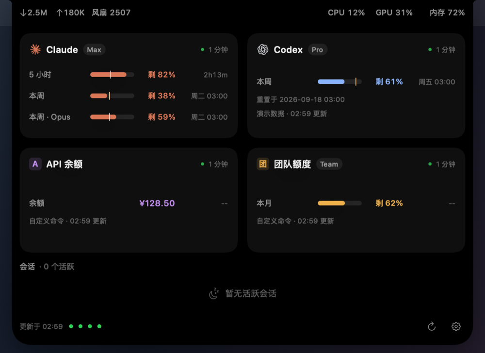

# AgentIsland · 刘海灵动岛

English: [README.en.md](README.en.md)

把 Mac 的屏幕刘海变成 Claude Code / Codex 的额度与会话面板。

以下截图均为内置 mock 数据，额度、套餐、会话和系统指标均为演示值。
截图日期使用固定示例时间并按 UTC 显示；已移除 EXIF/XMP 等附加元数据。

**收起**：图中启用了两家数据源，左侧 Claude 剩余额度，右侧 Codex 剩余额度。


**活动**：会话运行时，对应图标旋转并显示活动条（下图为静态帧）。


**展开**：刘海两翼显示网速、CPU、GPU、内存与风扇指标，下方为 Claude / Codex 两张额度卡。8 个虚构会话自动按家分列，左侧 Claude、右侧 Codex，展示执行中、思考中与等待输入状态。


默认显示剩余额度，悬停展开；也可选择点击展开。点击顶部固定，再次点击或点击岛外收起。会话行可查看详情，较多会话可滚动。默认优先内建屏，无刘海时显示顶部胶囊。全屏默认隐藏，可在设置中开启“全屏时显示”。会话变化不会自行展开窗口。

## 它能做什么

- 一眼查看 Claude / Codex 的剩余额度与重置时间。
- 会话进行中显示旋转图标和活动条，有计划时显示进度。
- 悬停或点击展开，查看会话状态、当前动作与上下文。
- 会话按状态排序：执行中最前，其次思考中（压缩上下文、重试中同级），再依次为等待授权、等待输入、出错、空闲、已结束。同一优先级内按项目归类，项目组按组内最新活动时间排序，无项目名的排在该档末尾；组内按活动时间倒序。双列时两家各自排序，单列时合并排序。
- 展开时显示网速、CPU、内存及设备可提供的 GPU 使用率、风扇转速。顶部指标带用满刘海屏两翼的可用宽度，与额度卡外沿对齐；无刘海屏上整行均匀分布，空间不足时自动精简。
- 数据源可单独开关并自动检测：默认用过 Claude Code / Codex、存在对应数据目录时才显示，也可在设置中手动开关。
- 只开一家时，收起态两翼优先显示这一家的不同额度周期；不足两个窗口时，另一翼显示 CPU。两家都没有且未添加其他数据源时，可作为系统监控使用，收起态显示 CPU 与内存。
- Claude Code 连接 GLM、Kimi 等第三方模型后端时，检测到无 Claude 凭据且最近模型名不以 `claude-` 开头，就只显示会话，隐藏官方额度与登录提示。
- 支持用命令接入其他工具的额度、余额，详见[自定义数据源](#自定义数据源)。
- 会话结束不会自动弹出，保持安静。

设置 → 会话列表 → 布局默认为“自动”：Claude 与 Codex 都启用、至少有 1 个未结束会话，且面板可用居中宽度至少 880 pt 时按家分两列（左 Claude、右 Codex），列头显示各家的活跃数；没有活跃会话时显示一行空状态。可固定选择“单列”（合并列表）或“双列”（没有会话时也保持两列）；屏幕可用宽度不足时，即使选择“双列”也会自动回退单列。双列长度独立，空列显示占位提示，短列下方留空；展开详情仅改变所在列，两列一起滚动。

## 系统要求

- macOS 14+，Apple Silicon 或 Intel。
- 有刘海的 MacBook 体验最佳；无刘海屏自动降级为顶部胶囊。
- Claude Code / Codex 均为可选：安装并使用后才有对应数据，官方额度需登录相应服务；两者都没有时也能作为系统监控使用。其他工具可通过[自定义数据源](#自定义数据源)接入。
- 从源码构建需要 Swift 6 工具链，Command Line Tools 即可，无需 Xcode。

## 数据与隐私

**本项目不收集任何数据，没有遥测，不上传会话内容。** 下述本地读取用于在你的 Mac 上显示信息。

图标在运行时从本机已安装的 Claude / ChatGPT 应用读取，未将第三方图标文件打包或作为独立素材分发；演示截图仅展示界面效果；未安装时使用自绘图标。

内置数据源的自动检测只检查 `~/.claude`、`~/.codex` 目录是否存在，不以 CLI 或桌面应用是否安装作为判据。第三方后端判定另外检查 Claude 凭据是否存在（此检查不读取凭据内容），并使用最近观察到的模型名；App 会在自己的 UserDefaults 设置中保存该模型名，仅模型名，不保存用于判定的会话内容。

GPU 使用率通过 IOKit 只读读取 IOAccelerator 的系统统计，无需管理员权限或额外授权；设备不提供读数时隐藏该指标。

启用对应内置数据源后，AgentIsland 读取以下本地数据以显示会话、动作、上下文与额度：

- `~/.claude/sessions/*.json`：会话与进程信息；不读取 `*.key`。
- `~/.claude/projects/*/*.jsonl`：主会话 transcript，增量读取，不读取子代理记录。
- `~/Library/Application Support/Claude/claude-code-sessions/` 下的 `local_*.json`：桌面会话标题、归档状态。
- `~/.codex/state_*.sqlite`：只读查询会话索引；失败时扫描今天/昨天的 `~/.codex/sessions/YYYY/MM/DD/rollout-*.jsonl`。
- Codex rollout 中的 `token_count` / `rate_limits`：启动时的本地额度，以及 app-server 失败时的兜底。缓存数据会显示来源与时间。

使用 Claude 官方额度时，网页或桌面登录不一定提供 Claude Code 的 OAuth 额度权限。请在终端执行一次 `claude auth login`；不在 PATH 时，可在设置中复制已定位的完整登录命令。运行时额度客户端通过系统 `/usr/bin/security` 读取 `Claude Code-credentials` 钥匙串项；该项不存在时，兼容读取 `~/.claude/.credentials.json`。令牌只在内存中使用，不写入 AgentIsland 配置、日志或导出；不会读取 `~/.codex/auth.json`，也不会持有 Codex token。判定为第三方后端后不查询 Claude 官方额度，也不为它启动官方额度的续期流程。

AgentIsland 自己发起的 HTTP 请求仅访问 `api.anthropic.com` 的 Claude 额度接口，不上传会话内容，不跟随重定向，不保存 HTTP 缓存或 Cookie，没有遥测。Codex 额度通过官方 `codex app-server` 子进程查询；官方子进程可能访问自己的服务端，自定义数据源命令也可按用户脚本访问网络，因此“除 api.anthropic.com 外不联网”仅适用于 AgentIsland 自身的 HTTP 客户端，不能作为整个子进程树的网络承诺。

AgentIsland 自身只读 Claude / Codex 的数据与配置，不安装 hook、不修改 statusLine。续期时由官方 CLI 自行更新其凭据，详见下文。设置保存在 AgentIsland 自己的 UserDefaults 中。解析异常只显示通用提示，不输出损坏记录原文。`--dump sessions` 会包含会话标题、项目路径和动作，请仅在本机检查，分享前自行脱敏。

自定义命令以明文保存在 App 设置中，输出和解析结果仅留在内存。`--dump providers` 的自定义条目不含命令或输出；`--dump quota` 会运行生效的自定义源并导出解析后的额度，详见下节。

## 自定义数据源

设置 →「自定义数据源」→「添加」，填写名称与命令，选择 1 / 5 / 15 / 30 分钟刷新（默认 5 分钟），先「测试运行」再保存。适合能编写脚本的用户；本期不内置其他服务。可选本机 `.app` 图标和徽标颜色。数据源列表可开关、编辑、删除，用 ↑ / ↓ 调整所有数据源顺序；收起态显示前两个有额度的生效数据源，展开态额度卡每行两张。

下图为内置假数据：Claude、Codex、「API 余额」和「团队额度」组成 2×2 卡片网格，分别演示文本余额与本月剩余百分比。



命令通过 `/bin/zsh -lc` 以当前用户身份执行，工作目录为用户主目录，登录 shell 会加载 `.zprofile` 的 PATH。找不到命令时请用绝对路径。启动、解锁、唤醒和点击刷新都会更新；锁屏与睡眠期间暂停。每个源独立定时、同一源串行，所有自定义命令最多同时运行 3 个（含测试运行）。超时 15 秒，向整个进程组发送 SIGTERM，2 秒后必要时 SIGKILL；关闭、删除也会终止进程组。失败保留上次成功数据并标记陈旧。

标准输出可以是一个剩余百分比数字，或完整 JSON：

```json
{
  "windows": [
    { "label": "本周", "remainingPercent": 62, "resetsAt": "2026-01-08T00:00:00Z", "periodSeconds": 604800 },
    { "label": "余额", "valueText": "¥128.50" }
  ],
  "plan": "Pro",
  "note": "可选的一行说明"
}
```

`windows` 接受 1–4 项，更多项仅取前 4 项。每项有 `label`，以及 `remainingPercent`（剩余）、`usedPercent`（已用）或 `valueText` 三选一；百分比必须为有限数值，越界夹到 0–100。文本最多 12 个字符。缺少名称、超长文本或窗口过多时，设置中会提示修正。未知字段忽略；`plan`、`note`、ISO 8601 的 `resetsAt`、正数 `periodSeconds` 均可省略。自定义源主要窗口为第 1 项；仅开一个源时，周期齐全则取最短与最长，否则取前两项；仅一个窗口时另一翼显示 CPU。翼内文本先缩字，再隐藏图标，仍放不下才截断；不会保留半截小数或省略号前的分隔符。

示例 1，最简剩余百分比：

```sh
echo 62
```

示例 2，静态 JSON（已用 40%，默认显示剩余 60%）：

```sh
echo '{"windows":[{"label":"本月","usedPercent":40}]}'
```

示例 3，**占位模板，不能直接用于任何真实服务**。URL、钥匙串条目名称和响应字段均为假设，需按所用服务的官方文档修改，并先自行创建对应钥匙串条目。建议把模板保存在你自己的脚本中，在设置中仅填写脚本路径。`jq` 自 macOS 15 起随系统提供，更早版本需自行安装。

```sh
#!/bin/zsh
set -euo pipefail
quota_api_key=$(/usr/bin/security find-generic-password -s 'ExampleQuotaKey' -w)
curl --fail --silent --show-error \
  --header "Authorization: Bearer ${quota_api_key}" \
  'https://quota.example.invalid/v1/usage' |
  jq '{windows: [{label: "本月", remainingPercent: .remaining_percent}]}'
```

命令以明文保存在 AgentIsland 自己的本机 UserDefaults 设置中。不要内联 API Key，建议在脚本中从钥匙串读取。App 不把命令、原始 stdout / stderr 或解析结果写入日志、诊断文件或缓存；仅设置中的命令文本会持久化。stdout 上限 64 KB，stderr 仅保留前 512 字节在内存中显示错误。用户脚本本身的网络访问与文件写入由脚本决定。

`--dump providers` 中的自定义源仅含 ID、名称、是否生效、上次运行时间与状态类别；运行记录仅在内存中，因此新启动的 dump 进程会显示空记录。`--dump quota` 会执行生效的自定义源一次，只导出解析后的额度数据（失败只导出错误类别）。`--mock` 和快照使用假数据，不执行用户命令。`--home` 隔离诊断不加载本机自定义设置。

## 下载安装

无需安装 Swift 工具链。前往仓库的 [Releases 页面](https://github.com/qp952154781/MacBookAgentIsland/releases)，下载 `AgentIsland-<版本>-macOS-universal.zip`，适用于 macOS 14+。

通用二进制同时包含 Apple Silicon（arm64）与 Intel（x86_64）。Intel 版已通过交叉编译与 Rosetta 下的运行验证，**尚未在真实 Intel Mac 上验证**，例如风扇等传感器读数可能不同；欢迎 Intel 用户反馈问题。

如需校验完整性，请同时下载同一 Release 的 `.zip.sha256` 文件，将两份文件放在同一目录，在终端进入该目录后运行（将 `<版本>` 替换为下载的实际版本号）：

```sh
shasum -a 256 -c 'AgentIsland-<版本>-macOS-universal.zip.sha256'
```

解压后，**先把 `AgentIsland.app` 拖进「应用程序」文件夹，再打开**。直接在「下载」文件夹中运行时，macOS 会通过 App Translocation 把应用放到随机的只读位置运行，导致开机启动注册失效。

**首次打开会被系统拦截。** 本项目没有付费的 Apple 开发者证书，应用只做了 ad-hoc 签名、未经 Apple 公证；源码完全公开，也可按下节说明自行构建。可选择以下任一种放行方式：

- 图形界面：尝试打开一次 → 打开「系统设置 → 隐私与安全性」→ 在页面下方找到被阻止的 AgentIsland → 点「仍要打开」→ 验证身份后再次确认打开。
- 终端：安装到「应用程序」后执行以下命令，再打开应用：

```sh
xattr -dr com.apple.quarantine /Applications/AgentIsland.app
```

打开后，岛会出现在屏幕顶部的刘海处；无刘海屏显示顶部胶囊。**没有 Dock 图标、没有常规窗口**，悬停在岛上即可展开，右键岛 → 设置。

**升级**：右键岛 → 退出旧版，用新版替换「应用程序」中的旧版，再打开；如被系统拦截，按上述步骤放行。若开机启动失效，在设置里关闭再开启一次，因为每次构建的 ad-hoc 签名不同。

## 从源码构建与安装

要求 macOS 14 或以上、Swift 6 工具链；仅使用系统框架，无第三方依赖。Command Line Tools 即可，无需 Xcode。

```sh
scripts/build.sh release
scripts/test.sh
scripts/bundle.sh
```

将生成的 `dist/AgentIsland.app` 拷贝到 `/Applications` 后打开。已有旧版时，请先从岛的右键菜单退出旧版。

也可运行 `scripts/install.sh` 自动构建、退出旧进程并安装。它会先验证新包，再替换旧包；旧包保留为 `/Applications/AgentIsland.previous.app`，确认正常后可手动移除。脚本不自动启动浮层，也不会申请管理员权限；无 Applications 写权限时请手动拷贝。

应用采用本机 ad-hoc 签名，未做 Apple 公证。release 构建会映射源码路径并移除可执行文件中的调试映射，避免附带构建者的绝对路径；本地调试请使用默认 debug 构建。应用自身图标由 `scripts/make-icon.sh` 调用 CoreGraphics 绘制并优先通过 `iconutil` 打包；若当前系统环境无法编码 ICNS，脚本会明确提示并用同一组 PNG 写入原生 ICNS 容器。应用自身图标没有使用第三方图片或官方 logo。

公开版应用标识为 `org.agentisland.AgentIsland`。从早期开发版升级时，旧偏好设置不会自动迁移；请先在旧版关闭开机启动，安装新版后重新设置并按需开启。

## 开机启动

右键岛 → 设置 → 开机启动。先把应用放进“应用程序”，再开启。若显示需要批准，请在“系统设置 → 通用 → 登录项与扩展”允许 AgentIsland。关闭同一开关即可取消。直接运行 `.build` 下的可执行文件不适合注册登录项。

也可运行 `/Applications/AgentIsland.app/Contents/MacOS/AgentIsland --login-item on` 开启（`off` 关闭、`status` 查询）；命令输出实际状态的 JSON 后立即退出，需要系统批准时会给出提示。

## 限制与已知问题

- 下载版使用 ad-hoc 签名，未做 Apple 公证，首次打开会被系统拦截；放行步骤见上文「下载安装」。
- 锁屏或睡眠期间暂停额度轮询，解锁或唤醒后恢复，因此显示的数据可能短暂陈旧。
- **Claude 令牌续期会启动官方 CLI**：access token 通常约 8 小时过期；普通非交互查询无法触发续期。临近或已经过期、或遇到认证失败时，App 会通过隐藏伪终端运行一次交互式 Claude Code，待输入框就绪后发送本地 `/usage` 命令，让官方 CLI 完成续期，再退出。此过程不发送对话提示、不消耗模型额度；App 不自行调用刷新接口或写入钥匙串。官方 CLI 可能联网并更新自己的凭据。
- 续期使用 AgentIsland 的专用目录，并通过启动参数关闭 Chrome 提示和 Remote Control。遇到首次设置、目录信任或登录提示时会退出并提示你在终端完成，**不会代替你确认**。登录失效或 CLI 界面变化仍可能需要人工处理。
- 本地会话与额度接口可能随官方客户端版本变化；GPU 与风扇指标在不支持的设备上会隐藏。构建目标支持两种处理器架构，不代表已覆盖所有设备组合的实机验收。

## 常见问题

**岛不显示**：确认应用运行于桌面会话；默认全屏隐藏，请退出全屏或在设置中开启“全屏时显示”。检查内建屏和主屏顶部；断开屏幕后会重新选择可用屏幕。没有可用 NSScreen 的后台会话无法显示浮层。系统自动隐藏菜单栏可能使 `visibleFrame` 与全屏相同，也会按全屏设置处理。

**额度未连接**：展开后查看卡片提示。Claude 请先完成 `claude auth login`；App 会尝试自动续期，明确提示登录失效时再重新登录。网络失败、请求过于频繁会显示错误或保留上次成功数据并标记陈旧（悬停卡头状态可查看原因），稍后自动退避重试，也可点击刷新。Codex 请安装并登录官方客户端；缺少可执行文件、启动失败、超时和接口错误都有提示。

**Codex 额度不更新**：本地 rollout 额度只随 Codex 新的 token_count 记录更新，不保证实时。查看来源和更新时间；确认官方客户端已登录，手动刷新以重新查询 app-server。索引被锁、损坏或不存在时会自动读取会话目录，并在会话区提示。

**会话记录异常**：截断或替换后重新读取；超过 16 MiB（16 × 1,048,576 字节）的单行、非 UTF-8 或坏 JSON 行会跳过并提示，其余行继续处理。每家最多保留 50 个近期会话，列表超过面板高度时可滚动查看。长标题按既有规则省略，可展开详情查看更多信息。

**重置时间异常**：过去的重置时间显示“—”，超出可显示范围时显示“时间异常”。系统时钟变化会触发刷新。锁屏或进入睡眠状态时暂停额度轮询和系统指标采样，会话扫描限为每家最多 30 秒一次；实际系统睡眠期间进程不执行，唤醒或解锁后立即重新读取。

## 本地验证

```sh
scripts/snapshot.sh
.build/release/AgentIsland --measure --mock idle --exit-after 300
.build/release/AgentIsland --measure --mock busy --exit-after 300
```

开发者可在自己的桌面会话中验证真实数据：

```sh
dist/AgentIsland.app/Contents/MacOS/AgentIsland --measure --exit-after 300
```

报告含 `dataMode`、`presentation`、CPU、驻留内存、真实数据峰值、`firstQuotaMs` / `firstSessionMs`。首次指标从程序入口起使用单调时钟计时，到真实服务结果进入 Store；空订阅不计入会话首批，错误不计入额度首批。它们不是屏幕实际绘制时间。`presentation=headless` 的结果不能替代窗口、真实数据、显示器和能耗验收。

## 致谢 / 灵感来源

受 Notchy、NookX 等刘海应用启发。AgentIsland 是独立项目，与 Anthropic、OpenAI 及上述应用没有隶属关系。

## 许可证：MIT

见 [LICENSE](LICENSE)。Copyright (c) 2026 AgentIsland contributors。
